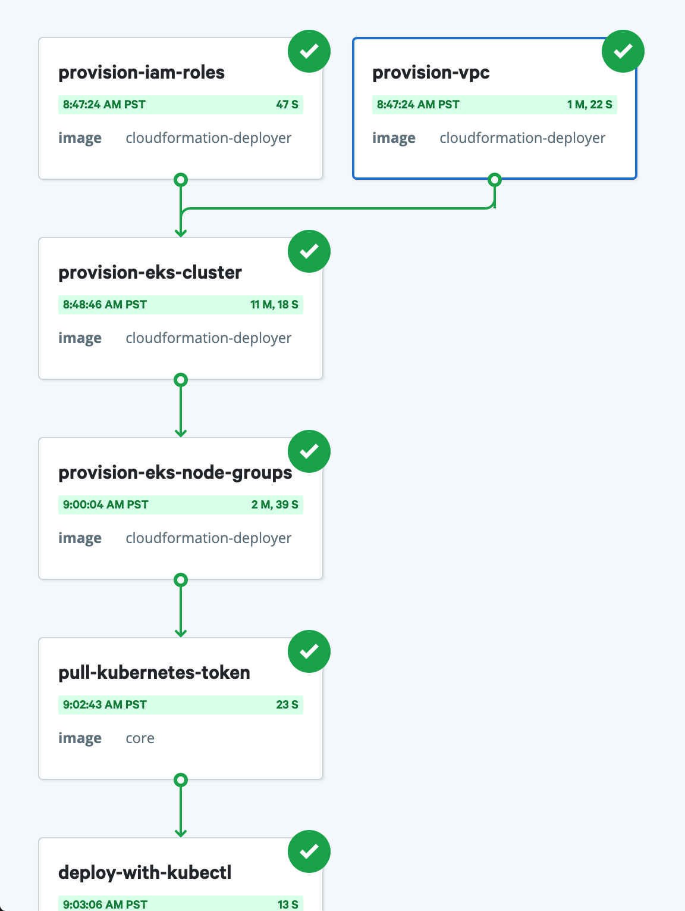

# Deploy a Gatsby site to EKS Cluster in AWS with CloudFormation and KubeCtl        
This sample workflow deploys a simple Gatsby site to Amazon Web Services (AWS).
The workflow provisions an Elastic Kubernetes Service (EKS) cluster on
AWS using CloudFormation, and deploys the app to the cluster using kubectl.

The workflow appears on the **Workflows** page in your Nebula web interface. If you don't see
it there, add the workflow from our [examples repo](https://github.com/puppetlabs/nebula-workflow-examples/tree/master/example-workflows/gke-provision-and-deploy-workflow) on GitHub. 

## Prerequisites

Before you run the workflow, make sure you have access to the following:
- A Slack authentication token. For more information, see [Getting a Slack token](https://get.slack.help/hc/en-us/articles/215770388-Create-and-regenerate-API-tokens). 
- IAM profile with the proper permissions for managing EKS clusters, Cloudformation Stacks, and IAM permissions

## Run the workflow

Follow these steps to run the workflow:
1. Add your Slack authentication token to the workflow as a secret.
   1. Click **Edit** > **Secrets**.
   2. Click **Define new secret** and use the following values:
      - **KEY**: `slack_token`
      - **VALUE**: Enter your Slack authentication token
2. Add your AWS access credentials as a secret.
   1. Click **Edit** > **Secrets**.
   2. Click **Define new secret** and use the following values:
      - **KEY**: `aws_access_key_id`
      - **VALUE**: Enter your AWS access key id associated with the account
      - **KEY**: `aws_secret_access_key`
      - **VALUE**: Enter your AWS secret access key associated with the account
3. Add the base64 encoded value of your Github SSH key as a secret.
   1. Click **Edit** > **Secrets**.
   2. Click **Define new secret** and use the following values:
      - **KEY**: `git_ssh_key`
      - **VALUE**: Enter the base64 encoded value of your Github SSH key
4. Configure your workflow parameters.
   1. Click **Run** and enter the following parameters:
      - **cluster_name**: Enter the name of the EKS Cluster that will be created in AWS. 
      - **region**: Enter the region you would like your CloudFormation stacks created in.
      - **slack_channel**: Enter the name of the Slack channel you'd like to
        notify when the workflow completes. For example, `#nebula-workflows`.
      - **slack_message**: Enter a message for the Slack notification. For
        example, `K8s cluster successfully provisioned with Nebula!`
      - **stack_name_prefix**: Enter the prefix that will be used for all CloudFormation stacks in the workflow.
4. Click **Run workflow** and wait for the workflow run page to appear. 

## Open the simple Gatsby site in a browser

To find the URL for your Sock Shop site:
1. Open the AWS console and find the appropriate load balancer created by the workflow. It should be tagged with a key of `kubernetes.io/cluster/<cluster_name>`
2. Copy the output and paste the URL into a browser.

Congratulations! You've deployed the a simple Gatsby site to EKS.

**Useful topics:**

- For more information on our curated step specifications, see [Step specifications](../step-specifications.md).
- If your team uses Microsoft teams, try the [Microsoft Teams notification](../step-specifications/msteams-notification.md) step.

